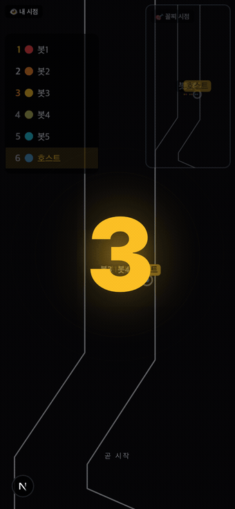
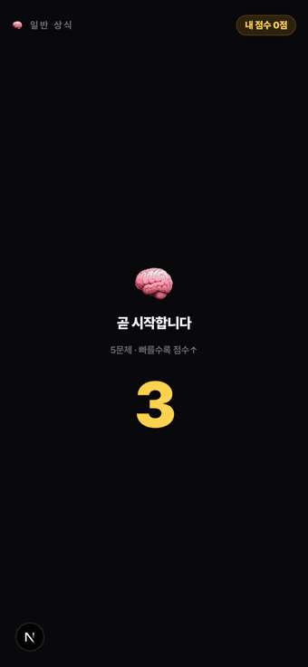

# 복불복 🎯

> **Made by [Mizeloble](https://github.com/Mizeloble)** · MIT License
>
> *Mobile party game where a group decides who takes the penalty via a quick minigame — open a room by QR, play one round, last place loses.*

<table>
  <tr>
    <td align="center"><b>🏁 마블 레이스</b></td>
    <td align="center"><b>🧠 일반 상식 퀴즈</b></td>
  </tr>
  <tr>
    <td></td>
    <td></td>
  </tr>
</table>

> 데모 GIF 갱신: 로컬 dev 서버 기동 후 `node scripts/capture-demo.mjs <marble|trivia>` → `/tmp/bbb-frames-<game>` 프레임을 ffmpeg로 `docs/demo-<game>.gif` 합성

여럿(4~12명, 최대 30명)이 폰으로 모여 **누가 벌칙을 받을지** 미니게임으로 정하는 복불복 멀티플레이 웹앱.

호스트가 방을 열고 QR 코드를 띄우면 다른 사람들이 폰 카메라로 스캔해서 입장 → 게임 한 판 → 꼴찌가 벌칙 🎯.

- **데모 배포**: [ax-lunch-coffee.fly.dev](https://ax-lunch-coffee.fly.dev) (Fly.io · 도쿄 nrt)
- **상태**: 마블 / 응원 마블 / 반응속도 / 일반 상식 퀴즈 활성. 슬롯·탈락 룰렛은 후속.

## 게임

| ID | 이름 | 길이 | 상태 |
| --- | --- | --- | --- |
| 🏁 marble | 마블 레이스 | ~35초 | **활성** |
| 📣 marble-cheer | 응원 마블 레이스 | ~40초 | **활성** — 시작 전 5초 탭 충전이 마블 물리에 미세 반영 |
| ⚡ reaction | 동시탭 반응속도 | ~8초 | **활성** — 회색 "준비…" → 노란 "지금!" 동시 탭, 가장 빠른 사람이 1등 |
| 🧠 trivia | 일반 상식 퀴즈 | ~30초 | **활성** — 4지선다 5문제, 속도·콤보 보너스, 마지막 문제 점수 2배 |
| 🎰 slot | 슬롯머신 룰렛 | ~8초 | 비활성 |
| 🎯 elimination | 탈락 룰렛 | ~20초 | 비활성 |

활성 여부는 [`src/games/types.ts`](src/games/types.ts)의 `GAME_META`에서 단일 진실. 카드는 모두 보이지만 비활성은 잠금.

## 주요 기능

- **방 만들기 → QR 입장**: 호스트가 방 만들고 QR 띄움 → 다른 폰이 스캔하면 같은 방 입장
- **닉네임 기억**: 첫 입장 시 입력 → `localStorage`에 저장 → 다음에는 자동 입장 ("바꾸기"로 변경 가능)
- **호스트가 직접 추가**: 폰을 안 가져온 사람도 호스트 화면에서 직접 등록·삭제 (오프라인 참가자)
- **누구나 초대하기**: 호스트뿐 아니라 게스트도 우상단에서 QR/링크 재공유 (옆자리 릴레이)
- **권위적 결과 + 동기 재생**: 서버가 시뮬·결정 → 리플레이 트랙 한 번에 브로드캐스트 → 모든 폰이 동일 wall-clock에 재생
- **재연결 복구**: 끊겨도 10초 grace 안에 같은 토큰으로 돌아오면 상태 복구
- **결과 후 자동 정리**: 결과 화면 3분 idle → 메인 자동 이동, 빈 방 60초 후 소멸
- **남용 가드**: 전역 동시 방 수 상한(`ROOM.MAX_ROOMS`)으로 무한 방 생성 차단 (단일 인스턴스 OOM 방지)
- **완전 메모리 전용**: DB·영속 저장소 없음. 방·플레이어는 서버 메모리에만, 서버 재시작 시 초기화 (공개 범용 서비스 — 그룹 간 데이터 격리 이슈 원천 차단)

## 개발

```bash
npm install
npm run dev            # http://localhost:3000 (Next + Socket.IO 동일 포트)
npm run typecheck
```

핸드폰 멀티 테스트는 https가 필요. iOS 카메라가 `http://...` LAN URL은 거부하기 때문:

```bash
ngrok http 3000        # 로컬 빠른 반복용
# 또는
fly deploy             # 90초, 실 LTE 환경 검증용
```

봇으로 부하 테스트하려면 [`scripts/sim-debug.ts`](scripts/sim-debug.ts) 참고.

## 배포 (Fly.io)

```bash
fly launch --copy-config --no-deploy   # 첫 배포 시
fly deploy
```

도쿄(nrt) 리전 + `shared-cpu-1x` / 512MB 한 대로 충분. 설정은 [`fly.toml`](fly.toml).

영속 저장소가 없어 볼륨 불필요 — `auto_stop_machines = "stop"`로 유휴 시 자동 정지(scale-to-zero). 상태는 전부 메모리라 머신이 자거나 재배포되면 진행 중인 방은 사라지고 새로 시작.

## 아키텍처 한눈에

- **Next.js 16 (App Router)** + 커스텀 Node 서버([`server.ts`](server.ts))에 **Socket.IO** 부착
- **box2d-wasm**으로 서버에서 헤드리스 물리 시뮬, 클라는 받은 프레임 재생만 ([`src/games/marble/`](src/games/marble/))
- 방·플레이어는 서버 메모리 `Map`에만 (빈 방 60초 후 소멸). DB·영속 저장소 전혀 없음
- 모바일 퍼스트 UI: Tailwind + Pretendard, amber-400 = primary
- 한국어 카피는 [`src/lib/i18n.ts`](src/lib/i18n.ts) 한 곳에서만

## 폴더별 가이드

각 폴더의 `CLAUDE.md`에 불변조건·금기만 기록:

- [`/CLAUDE.md`](./CLAUDE.md)
- [`src/server/`](src/server/CLAUDE.md) — 방 메모리, 권위적 결과, 호스트 식별
- [`src/games/`](src/games/CLAUDE.md) — GameModule 인터페이스, 새 게임 추가 순서
- [`src/games/marble/`](src/games/marble/CLAUDE.md) — 마블 시뮬·렌더, lazygyu 출처
- [`src/games/marble-cheer/`](src/games/marble-cheer/CLAUDE.md) — 응원 충전 변형 (sim 공유)
- [`src/games/reaction/`](src/games/reaction/CLAUDE.md) — 반응속도, 서버 도착 시각만 진실
- [`src/games/trivia/`](src/games/trivia/CLAUDE.md) — 트리비아, 결정성·답변 윈도우·문제 풀 추가 규칙
- [`src/components/`](src/components/CLAUDE.md) — 모바일 UI 규약, amber 위계
- [`src/app/`](src/app/CLAUDE.md) — App Router 구조

## 기여

이슈·PR 환영합니다. UI 문자열은 반드시 [`src/lib/i18n.ts`](src/lib/i18n.ts) 한 곳에서만 (인라인 한국어 금지). 변경 후 `npm run typecheck` 통과 필수.

## 크레딧 / 라이선스

- 제작: **[Mizeloble](https://github.com/Mizeloble)**
- 라이선스: [MIT](LICENSE)
- 마블 물리: [lazygyu/roulette](https://github.com/lazygyu/roulette) (MIT) — `src/games/marble/lazygyu/`에 출처 명시 ([NOTICE](NOTICE))
